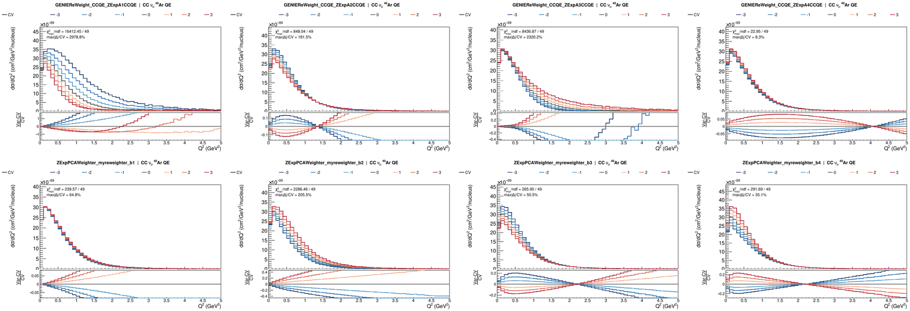

# Z-expansion CCQE axial-FF systematics

*PCA-rotated dials designed and implemented by Abi Peake, first
presented at the DUNE DIRT-II working-group meeting on 13 March 2023
([event 1264558](https://indico.cern.ch/event/1264558/),
[slides](https://indico.cern.ch/event/1264558/contributions/5310838/attachments/2614120/4517520/Axial%20form%20factor%20presentation.pptx%20\(3\).pdf)).
The corresponding dials are handled by the `ZExpPCAWeighter` provider.*

`nusystematics` ships two ways to vary the CCQE axial form factor when the
loaded GENIE tune uses the Z-expansion parameterisation: the raw
GENIE-Reweight dials `ZExpA1..4CCQE` + `ZNormCCQE` (via provider
`GENIEReWeight_CCQE`) and the PCA-rotated dials `b₁..b₄` (via
`ZExpPCAWeighter`). Both are declared automatically by
`nusyst config --mode all` when the tune warrants it, and both appear in
`nusyst inventory --mode CCQE`. This document explains what each set is,
why both are shipped, and which one to use when.

For the surrounding CLI (config generation, inventory, dumping tweaks,
plots), see [`doc/CLI_TOOLS.md`](CLI_TOOLS.md).

---

## Physics primer

GENIE's charged-current quasi-elastic (CCQE) cross section depends on the
nucleon axial form factor `F_A(Q²)`. Two parameterisations are in
common use:

- **Dipole.** `F_A(Q²) = g_A / (1 + Q²/M_A²)²`. One knob: the axial mass
  `M_A`. Reweighting is handled by GENIE's `MaCCQE` (and, for the
  effective-Fermi-momentum variant, `E0CCQE`).
- **Z-expansion.** Introduced in *PRD 93, 113015*, arXiv:1603.03048. Maps `Q²` onto the analyticity
  disk via `z(Q²)` and expands the form factor in powers of `z`:
  `F_A(Q²) = Σ_{k=0..4} a_k z(Q²)^k`. It is essentially a way of expressing the form factor as a Taylor series but in a space where the sum converges (whereas if it is expressed plainly as a function of `Q²` it diverges). Fitting the series with 4 terms (and thus 4 free parameters) to deuterium data yields the
  four independent coefficients `a₁..a₄` (with `a₀` fixed by the axial coupling constant, well known) and a 4×4 covariance matrix.

Because the fit constrains one linear combination of the `aₖ` far more
tightly than the others, the published covariance has strong
off-diagonal terms, which means the parameters must be varied together and as a result cannot be factorized as the product of the four termms. Treating the four `aₖ` as independent 1σ dials misrepresents the size of the constraint from the deuterium fit and misses the anti-correlations that make the total
uncertainty envelope much narrower than the naive quadrature sum.

The PCA family diagonalises that covariance once, at construction time,
producing four orthogonal unit vectors `b₁..b₄`. Sampling
`bₖ ~ N(0, 1)` and mapping back to `aₖ`-space gives correlation-correct
variations of the dials.

---

## Which family is active (automatic tune-based selection)

There is no `--include-zexp` (or `--include-dipole`) flag. Selection is
driven by the loaded GENIE tune.

`GenerateAllDialsConfigNuSyst` probes the active `GReWeightNuXSecCCQE`
engine at startup via a helper `DetectCCQEFFMode()` that inspects which
dial IDs the engine accepts (internal enum values are `Dipole`, `ZExp`,
`Unknown`). The result is printed near the top of tool output:

```
[INFO] CCQE axial form factor detected: z-expansion
       (dial set selected accordingly; the inactive family is silently
       ignored by the runtime engine)
```

The dropped-dial section then lists each wrong-family dial with its
reason, e.g.:

```
MaCCQE (dipole CCQE FF -- loaded tune uses Z-expansion axial FF)
E0CCQE (dipole CCQE FF -- loaded tune uses Z-expansion axial FF)
```

If the probe reports `unknown` (typically because `GENIE_XSEC_TUNE` is
not exported), both families are emitted; see
[Troubleshooting](#troubleshooting).

The `ZExpPCAWeighter` provider is not gated by this mechanism. It loads
whenever its FCL is picked up during the `providers` scan, and its
underlying `GReWeightNuXSecCCQE` engine will silently produce trivial
weights on a dipole tune. In practice this means the PCA family should
only be enabled when the loaded tune is z-expansion.

---

## The two dial families

### Raw `ZExpA1..4CCQE` + `ZNormCCQE` (provider `GENIEReWeight_CCQE`)

Each dial shifts one coefficient independently:

```
a_i_new = a_i_default * (1 + twk_i * fracerr_zexp[i])
```

The per-coefficient fractional errors `fracerr_zexp[i]` come from
GENIE's `CommonParam.xml`. **There is no correlation matrix in this
layer**: tossing all four at ±1σ ignores the strong anti-correlations
among the `aₖ`.

Useful for one-at-a-time studies (e.g. "does the tail of my `Q²`
distribution move when I push `a₃` alone?"). Wrong for a
covariance-aware systematic envelope.

The variation grid, by default, is `[-3, -2, -1, 0, 1, 2, 3]` (seven
points); override with `--variation-descriptor` on
`nusyst config`.

### PCA-rotated `b₁..b₄` (provider `ZExpPCAWeighter`)

Diagonalises the published 4×4 covariance once at construction with
`Eigen::SelfAdjointEigenSolver`:

```
Σ = V Λ Vᵀ                // V = eigenvectors, Λ = diag(eigenvalues)
P = V · diag(√Λ)           // decorrelation transform (per-column √λₖ · vₖ)
```

The user-facing dials `b₁..b₄` are the orthogonal unit vectors in the principal-component basis. At weight time:

```
a_shift     = P · b                                  // ChangeBasisBParams
a_for_genie = ((a_cv + a_shift) / a_genie_default - 1) / fracerr_zexp_genie
                                                     // ScaleAparamsforGenie
// -> pushed into the underlying ZExpA1..4CCQE GReWeight dials.
```

So `b` is the basis you'd want to draw correlated toys from; the raw
`ZExpA*CCQE` are the basis the actual GENIE reweighter uses internally.

**Canonical FCL:** `fcl/zexpansion_weighter.ToolConfig.fcl`. The
variation grid uses seven points in `[-3, +3]` for each `bₖ`:

```
b1_variation_descriptor: "(-3,3,1)"
b2_variation_descriptor: "(-3,3,1)"
b3_variation_descriptor: "(-3,3,1)"
b4_variation_descriptor: "(-3,3,1)"
```

CV values default to 0 (unit toys). The hardcoded covariance and the
`aₖ`-basis central values live in the `namespace PRD_93_113015` block
inside `src/nusystematics/systproviders/ZExpPCAWeighter_tool.cc`:

- `a_14_cv     = { 2.30, -0.60, -3.80,  2.30 }`  -- paper-basis central values
- `a_14_errors = { 0.13,  1.00,  2.50,  2.70 }`  -- paper-basis diagonal errors (= √diag(Σ))
- 4×4 covariance matrix `Σ` in the paper's `aₖ` basis:

```
Σ  =  ⎡  0.0169    0.0455   -0.22035   0.214461 ⎤
      ⎢  0.0455    1.0      -2.245     0.9909   ⎥
      ⎢ -0.22035  -2.245     6.25     -4.62375  ⎥
      ⎣  0.214461  0.9909   -4.62375   7.29     ⎦
```

The diagonal is `σᵢ² = a_14_errors² = {0.0169, 1.0, 6.25, 7.29}`; the
off-diagonals encode the strong `a₁↔a₃` anti-correlation that PCA is
built to unwind.

**Unit caveat.** The matrix above is in the **paper's a-basis**: the
raw coefficients from the Meyer et al. deuterium fit, dimensionless,
with `a_14_errors` as the per-coefficient 1σ. GENIE's Reweight
framework, however, ships a **different** set of per-coefficient
diagonal errors (loaded from `GSystUncertaintyTable.xml`, roughly
`{0.14, 0.67, 1.0, 0.75}`), and the raw `ZExpA*CCQE` dials are
normalised as "how many of *those* σ do you shift by" -- not in the
paper's basis. `ScaleAparamsforGenie()` in the same source file does
the bridging: it takes a shift computed in the paper's a-basis via
`P·b`, adds it to `a_cv`, expresses the result as a fractional
deviation from GENIE's own default `a_k` values, and divides by
GENIE's diagonal errors to convert to GENIE tweak units. Only after
this conversion is the value pushed into the underlying
`ZExpA*CCQE` reweight engine. Editing any of these three arrays
without updating the others will therefore misalign the two bases;
see the recipe below.

### Changing the CV or covariance

To swap in a different fit (e.g. the Meyer-LQCD lattice fit,
[arXiv:2601.02676](https://arxiv.org/abs/2601.02676), or an in-house
re-fit), edit the
`namespace PRD_93_113015` block in
`src/nusystematics/systproviders/ZExpPCAWeighter_tool.cc` and rebuild.
The block holds five arrays; all four that describe a-basis
quantities must be kept mutually consistent:

1. `a_14_cv` -- paper-basis central values of `a₁..a₄`.
2. `a_14_errors` -- paper-basis diagonal 1σ. Must equal `√diag(Σ)`.
3. `Covariance_Matrix` -- the paper-basis 4×4 `Σ`. Symmetric by
   construction. Diagonal must equal `a_14_errors²`.
4. `central_values_afrom_errors_genie` -- same numbers as
   `a_14_errors`, mirrored here so `ScaleAparamsforGenie` can access
   them cheaply. Update in lockstep with (2).
5. `central_values_a_from_genie` -- the a-basis CV values the loaded
   GENIE tune expects (from `ZExpAxialFormFactorModel.xml` in that
   tune). If the new fit ships a tune whose `QEL-Z_A1..A4` differ
   from `{2.30, -0.60, -3.80, 2.30}`, update this array to match.
   Leave alone if you keep the same tune.

Then:

- **Rename the namespace** from `PRD_93_113015` to something corresponding to the new
  source (e.g. `MEYER_LQCD_2026`, `INHOUSE_FIT_2026`). 
- **Do not touch** `central_values_afrom_errors_genie_code` unless
  you also update GENIE's `GSystUncertaintyTable.xml` in lockstep.
  That array reflects what GENIE ships and is the divisor in the
  unit conversion.
- Rebuild `nusystematics` (`make install -j ...`) so the new
  numbers get compiled in.
- Sanity-check with `nusyst inventory --mode CCQE` (the four `b₁..b₄`
  dials should still appear) and re-run the validation recipe below
  to confirm the `bₖ` response envelope is what the new covariance
  predicts.

We are working on implementing a more flexible way of updating these values.

---

## End-to-end validation recipe

Compare per-event responses for the two families on the same events.
Assumes `nusystematics` is installed and on `PATH`, that
`GENIE_XSEC_TUNE` selects a Z-expansion tune (e.g. `AR23_20i_00_000`),
and that `$GHEP` points to a GHEP ntuple produced with that tune.

```bash
# 1. Emit a config that contains both dial families.
nusyst config --mode all -o /tmp/zexp.fcl

# 2. Verify: both raw ZExpA*CCQE and PCA b* appear side by side.
nusyst inventory --mode CCQE -c /tmp/zexp.fcl --verbose

# 3. Per-event weight-vs-paramValue curves for the two families
#    on the same events (grep params by substring).
nusyst response  -c /tmp/zexp.fcl -i $GHEP \
                 -p ZExpA,b1,b2,b3,b4 \
                 -N 300 -n 2 -o /tmp/zexp_resp

# 4a. Flat-tree dump of every dial x every variation.
nusyst tweaks    -c /tmp/zexp.fcl -i $GHEP \
                 -o /tmp/zexp_dump.root -N 5000 -j 4

# 4b. Differential-xsec ratio panels split by channel.
nusyst plots     -c /tmp/zexp.fcl -i /tmp/zexp_dump.root \
                 -o /tmp/zexp_plot
```

What to look for:

- The `b₁..b₄` response envelope on the constrained direction (the
  eigenvector with the smallest `λₖ`) should be visibly *narrower*
  than the naive envelope you'd get by summing raw `ZExpA*CCQE`
  responses in quadrature. This is the anti-correlation working as
  advertised.
- The `b₁..b₄` curves should be smooth and monotonic in `bₖ`.
  Non-monotonic behaviour usually means the toy pushed the underlying
  `aₖ` past the range where GENIE's reweighting applies.

### Example output on a DUNE FD νμ FHC sample

The recipe above was run on a GENIE GHEP file for the DUNE far
detector flux, νμ FHC beam, AR23 tune, GENIE 3.06, with a full sample of 1,000,000
events (of which roughly 137,000 are CCQE on ⁴⁰Ar), filtered at the
plot stage to the eight z-expansion dials only. The panels below are
the per-channel `CC νµ ⁴⁰Ar QE` view, which restricts to pure CCQE on
argon so that the raw and PCA dials are compared on the same
event population.

Top row: raw `ZExpA1..4CCQE` at ±3σ, one coefficient at a time.
Bottom row: PCA-rotated `b₁..b₄` at ±3σ, orthogonal unit-variance
toys. Each column pairs `a_k` (top) directly above `b_k` (bottom).



Read the ratio panels (`(Var - CV) / CV`, bottom of each subplot) and
the `max|Δ|/CV` annotation in each subplot. Values below are on the
`CC νµ ⁴⁰Ar QE` channel (pure CCQE):

| Dial | max\|Δ\|/CV | Body envelope (Q² ≲ 2 GeV²) |
|---|---|---|
| `ZExpA1CCQE` | ~2980% | ~±100%, sign-inverting at ~1.5 GeV² |
| `ZExpA2CCQE` | ~180%  | ~±30%  |
| `ZExpA3CCQE` | ~2320% | ~±100%, sign-inverting at ~1 GeV² |
| `ZExpA4CCQE` | ~8%    | ~±5%   |
| `b₁` | ~65%  | ~±10% |
| `b₂` | ~205% | ~±40% |
| `b₃` | ~50%  | ~±15% |
| `b₄` | ~35%  | ~±15% |

Two observations from the plots. First, tossing `a₁` or `a₃` alone at
±3σ inverts the sign of the response across the Q² spectrum (peak
enhanced at low Q², depleted in the tail, or the reverse), driven by
the individual coefficient's contribution to `F_A(Q²) = Σ aₖ z(Q²)ᵏ`.
The headline `max|Δ|/CV` numbers of ~2000-3000% reflect this: the
variation adds or removes a large fraction of the CV cross section on
its own, ignoring the strong anti-correlation with the other
coefficients that would normally cancel most of the effect.

Second, the PCA envelope is dramatically smaller in the constrained
direction (`b₁` at ~10%) and never inverts the shape. The four `bₖ`
combined in quadrature give an envelope on the order of ~50% -- roughly
what the PRD 93, 113015 covariance says the physical CCQE axial-FF
uncertainty is at ±3σ. The raw `aₖ` summed in quadrature would predict
~4000%, a factor of ~80 overcount, because most of the raw envelope
lives in unphysical directions of `aₖ`-space that data has already
constrained away.

---

## When to use which basis

> ⚠️ **Heads up.** Both families are present in a `--mode all` config
> purely so they can be compared for validation. 🚨 Do **not** enable
> both simultaneously in a fit or systematic envelope: they parameterise
> the same physics in two different bases and double-count.

- **Fits and systematic envelopes:** use `b₁..b₄` (PCA) only.
- **Per-coefficient physics studies** (e.g. "which coefficient controls
  the high-`Q²` tail?"): use raw `ZExpA1..4CCQE` only.
- ⚠️ **Never both together.** ⚠️

---

## Troubleshooting

**`[INFO] CCQE axial form factor detected: unknown`**
`GENIE_XSEC_TUNE` is not exported, so the transient
`GReWeightNuXSecCCQE` probe can't resolve the tune's axial-FF model.
Both families are emitted. Fix by exporting the tune before running
`nusyst config`:

```bash
export GENIE_XSEC_TUNE=AR23_20i_00_000
nusyst config --mode all -o /tmp/zexp.fcl
```

**`WARN ReW: Systematic ZExpA1CCQE is not handled for algorithm ...`**
A dipole tune is loaded but a z-expansion dial reached the engine. In
normal `nusyst` workflows this can't happen because
`GenerateAllDialsConfigNuSyst` filters the wrong family out. If you see
it, a hand-written config likely bypassed the filter, or the reweighter
was instantiated with a tune override that differs from
`GENIE_XSEC_TUNE`. Regenerate the config with `nusyst config` and check
the `[INFO] CCQE axial form factor detected: ...` line matches your
tune's expected FF model.

**PCA `bₖ` responses look identical to raw `ZExpAₖ` responses.**
The PCA rotation collapses toward the identity when the loaded tune's
`aₖ` defaults happen to sit exactly at `PRD_93_113015::a_14_cv`
(`{2.30, -0.60, -3.80, 2.30}`). On tunes whose `aₖ` defaults differ
substantially, the two families will diverge, which is the point.
This is a limitation of the hardcoded CV, not a reweighting bug.

---

## References

- A. S. Meyer, M. Betancourt, R. Gran, R. J. Hill, "Deuterium target
  data for precision neutrino-nucleus cross sections," *Phys. Rev. D*
  **93**, 113015 (2016). arXiv:[1603.03048](https://arxiv.org/abs/1603.03048).
  This is the fit whose central values and covariance the PCA
  provider reads from `namespace PRD_93_113015` in
  `src/nusystematics/systproviders/ZExpPCAWeighter_tool.cc`.
- GENIE Reweight `GReWeightNuXSecCCQE` (`RwCalculators/GReWeightNuXSecCCQE.h`)
  is the engine used by both providers; the raw family sets
  `kModeZExp` at construction, and the PCA family instantiates one
  engine per (parameter × variation) with the same mode.
- A. Peake, "Z expansion" (Abi's talk), DUNE DIRT-II working-group
  meeting, 13 March 2023.
  [Event page](https://indico.cern.ch/event/1264558/) /
  [slides](https://indico.cern.ch/event/1264558/contributions/5310838/attachments/2614120/4517520/Axial%20form%20factor%20presentation.pptx%20\(3\).pdf).
  Origin of the `ZExpPCAWeighter` PCA rotation approach.
- CLI reference for the surrounding tools:
  [`doc/CLI_TOOLS.md`](CLI_TOOLS.md).
